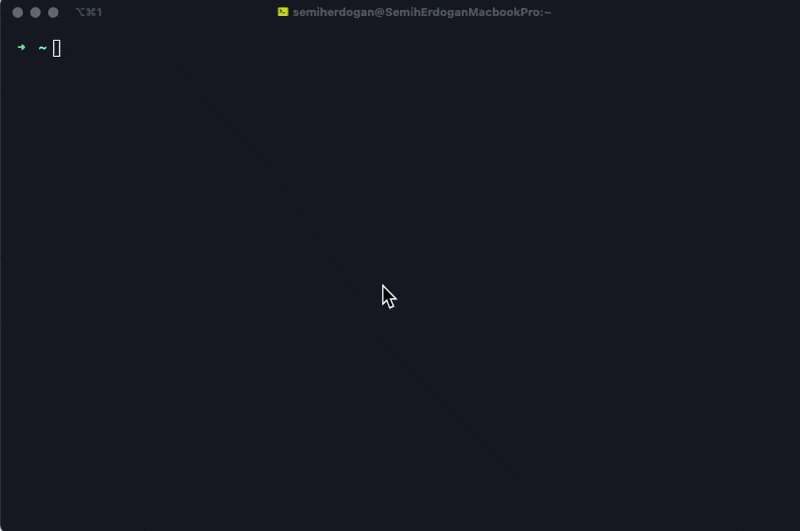

# Sql Actions

Create sql queries from tab separated data.
With this tool you can create insert, update, delete and bulk insert queries. (See [How it works](#how-it-works) section)

# Installation
- Download standalone binary from [releases](https://github.com/semiherdogan/cli-sql-actions/releases).
- Move downloaded file to `$PATH`.
- At first run MacOS may need permissions to run this app. To do that you need to allow it from "Security & Privacy" section.
- Or you can download source code and compile on your own.

# How it works

# Usage
Run `sql-actions` from your terminal, then select which query you want to generate, then follow the instructions.

# License
The MIT License (MIT). Please see [License](LICENSE.txt) file for more information.
